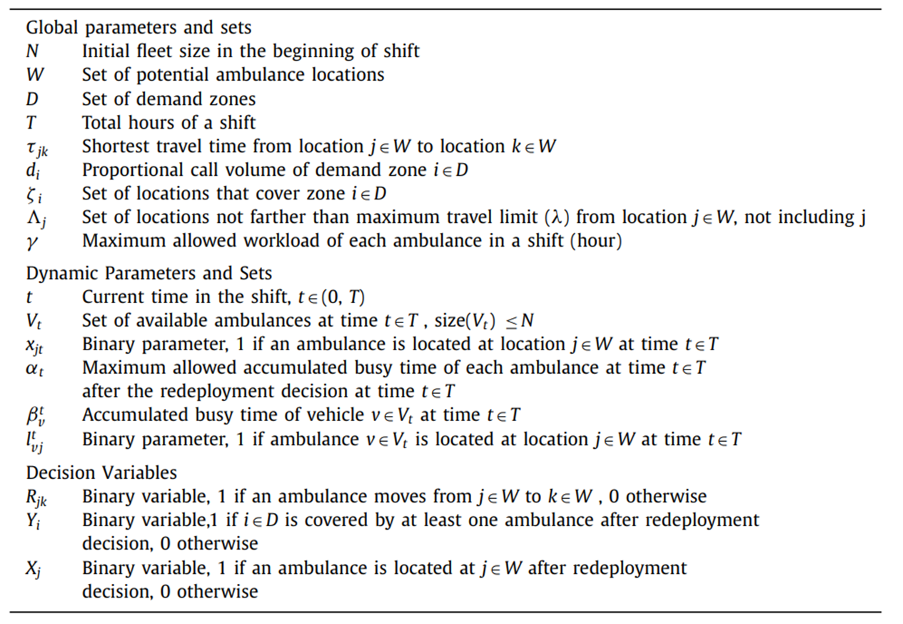
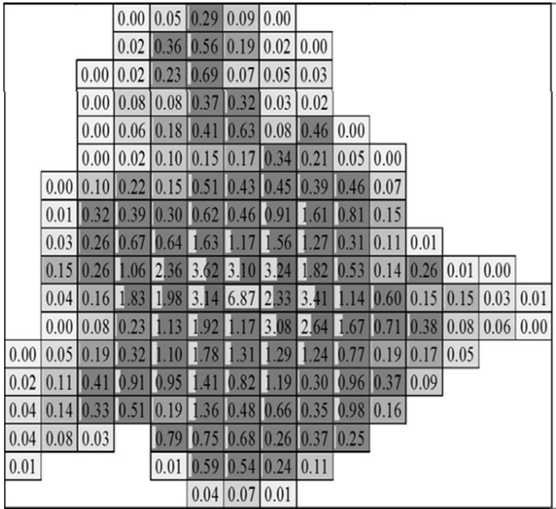

# 🚑 Real-time Ambulance Redeployment and Dispatching with Balanced Coverage and Workload

本研究針對 **緊急醫療服務 (EMS)** 系統，模擬救護車的動態調度與再部署策略，並比較傳統靜態 (Static) 政策與基於 **Redeployment Optimization Approach (ROA)** 的動態政策，同時也根據救護車初始位置及病患種類等條件，細分為四種情境進行模擬，期望能提升病患服務覆蓋率並降低救護車工作負載的不均衡。

---

## 📌 研究背景
緊急醫療服務 (EMS) 接收到的呼叫隨機且不可預測，包括到達時間、地點及服務需求。傳統靜態政策通常要求救護車在完成任務後返回原始位置待命，然而其具有以下缺點：
- 無法因應動態需求
- 可能導致服務覆蓋出現空缺
- 平均反應時間拉長

因此，本研究提出 **即時動態再部署策略 (ROA)**，在呼叫處理與救護車閒置之際，決定是否重新配置救護車，以提升系統覆蓋率與降低平均等待時間。

---

## 🛠 方法與模型
### 符號定義
<div align="center">

</div>

### 模擬方式
- **離散事件模擬 (Discrete-Event Simulation, DES)**
  - 模擬呼叫到達、服務完成、再部署完成等事件
  - 比較 **Static Policy** 與 **ROA Policy**

<div align="center">

</div>

### 最佳化模型
- **最大覆蓋選址模型 (Maximal Covering Location Problem, MCLP)**  
  - 用於決定初始救護車配置。

<div align="center">
  
</div>

- **Redeployment Optimization Approach (ROA)**  
  - 限制條件包含：救護車移動時間、工作負載上限、單點限制等  
  - Step 1: 最大化覆蓋率  

<div align="center">
  
  
</div>

  - Step 2: 在維持覆蓋率的條件下最小化總移動時間  

<div align="center">
  
</div>

---

## 📊 輸入與假設
- **需求區劃分**：168 個需求區，每格大小 2 × 2 miles  
- **醫院數量**：3  
- **救護車數量**：20  
- **患者類型**：
  - Type 1：10 分鐘內到達
  - Type 2：不同限制 (15, 10, 5 分鐘)
- **資料來源**：2004 年美國北卡羅來納州 Mecklenburg County
<div align="center">
  
  
</div>

---

## 📈 主要績效指標
- **SC**：在規定時間內抵達比例 (Service Coverage)
- **AWA**：救護車平均工作量 (Average Workload of Ambulances)
- **ASDW**：救護車工作量標準差
- **AWT**：平均等待時間 (Average Waiting Time)
- **Queue Length**：平均佇列長度

---

## 📂 專案結構
├── SimClasses.py #

├── SimFunctions.py #

├── SimRNG.py # 

├── project_final.py # 主程式 (模擬 + 最佳化)

├── demand_volume.xlsx # 區域需求資料

├── simulation_result/ # 模擬結果

└──  model4_sensitivity/ # 敏感度分析資料

---

## ⚙️ 環境需求
- Python 3.10+
- 主要套件：
  - `numpy`
  - `pandas`
  - `matplotlib`
  - `scipy`
  - `tqdm`
  - `cplex` (需安裝 IBM ILOG CPLEX Optimization Studio)
  - `SimClasses`, `SimFunctions`, `SimRNG` (自訂模擬模組)

安裝方式：
```bash
pip install numpy pandas matplotlib scipy tqdm
```

---

## ▶️ 執行方式

1. 確保已安裝 **IBM ILOG CPLEX** 並正確設定 Python API 環境。  
2. 準備需求資料 `demand_volume.xlsx`。  
3. 執行模擬程式：
   ```bash
   python project_final.py
   ```

---

## 📊 實驗結果 (摘要)

- **ROA 政策相較於 Static 政策**：
  - 顯著提升 **服務覆蓋率 (SC)**
  - 明顯降低 **平均等待時間 (AWT)**
  - **工作負載 (Workload)** 分配更平均，避免集中於少數救護車
- 敏感度分析：
  - 救護車數量減少時，ROA 的優勢更明顯
  - 調整 **再部署限制 (時間/比例)** 會顯著影響覆蓋率與等待時間

---

## 📚 參考文獻

- Boujemaa, R., Jebali, A., Hammami, S., & Ruiz, A. (2020). Multi-period stochastic programming models for two-tiered emergency medical service system. Computers & Operations Research, 123, 104974.
- Bélanger, V., Lanzarone, E., Nicoletta, V., Ruiz, A., & Soriano, P. (2020). A recursive simulation-optimization framework for the ambulance location and dispatching problem. European Journal of Operational Research, 286(2), 713-725.
- Enayati, S., Mayorga, M. E., Rajagopalan, H. K., & Saydam, C. (2018). Real-time ambulance redeployment approach to improve service coverage with fair and restricted workload for EMS providers. Omega, 79, 67-80.
- Neira-Rodado, D., Escobar-Velasquez, J. W., & McClean, S. (2022). Ambulances deployment problems: categorization, evolution and dynamic problems review. ISPRS International Journal of Geo-Information, 11(2), 109.
- Rajagopalan, H. K., Saydam, C., & Xiao, J. (2008). A multiperiod set covering location model for dynamic redeployment of ambulances. Computers & Operations Research, 35(3), 814-826.

---
